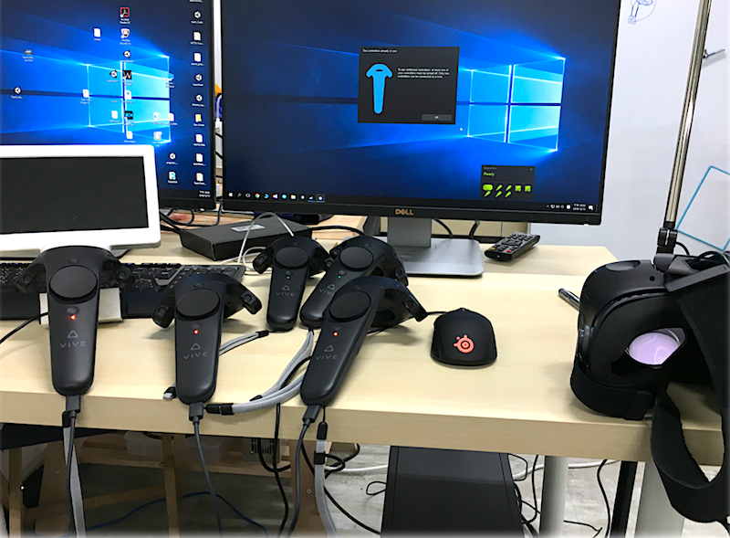
To discover more possibilities in interaction design field, we try to combine different advanced device as mush as we can, to create a realistic experience, even beyond reality, and make the interaction process smoothly.

<!-- more -->

# An idea hexagon - Solution-driven approach
### Finding the neXt
The hexagon provide a systematic way to generate many unique solutions
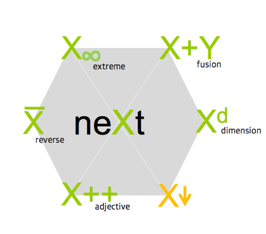

#### Three principles
- Start with something new, interesting, never seen before.
- Iterate quick. by looking for variations of solutions and problems.
- Give up soutions quick.

#### An example of the creative ideas when using camera
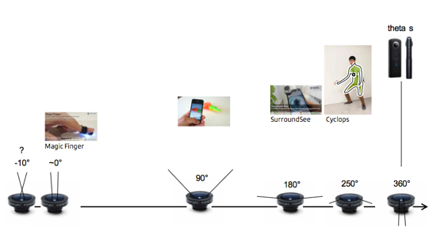

### Rotoscoping
An animation technique in which animators trace over footage, frame by frame, for use in live-action and animated movies.
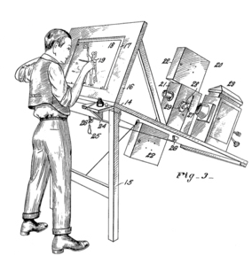
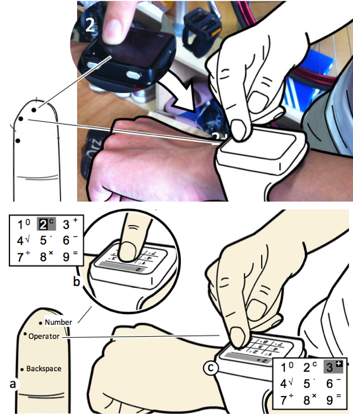

### 360 Camera
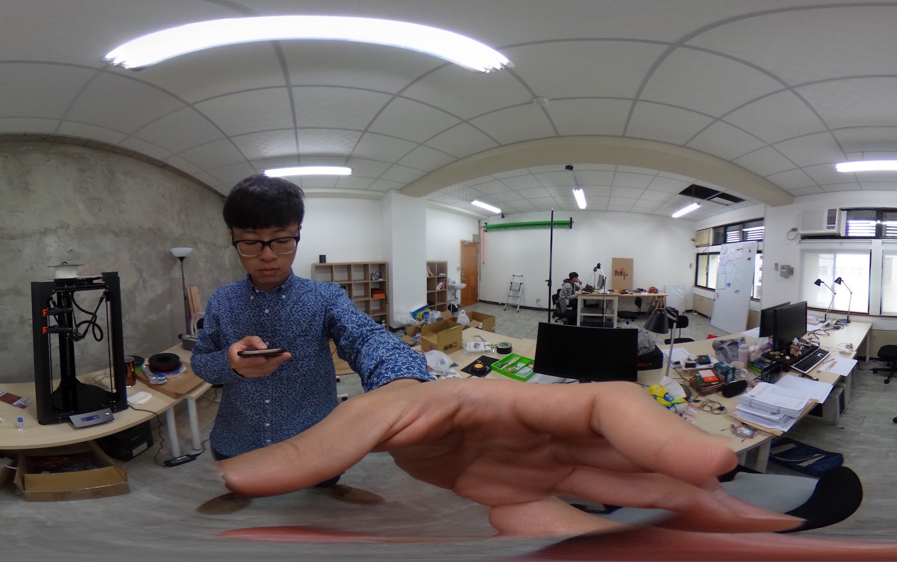
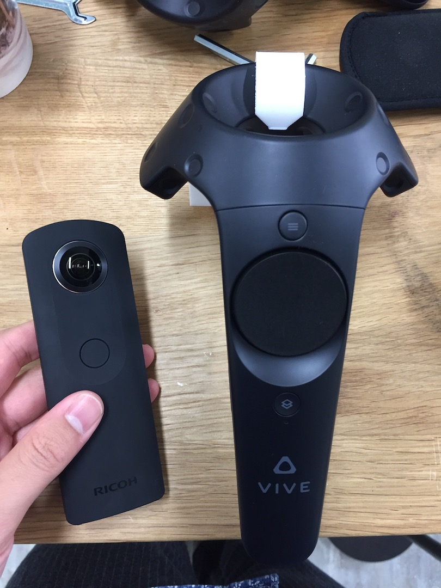
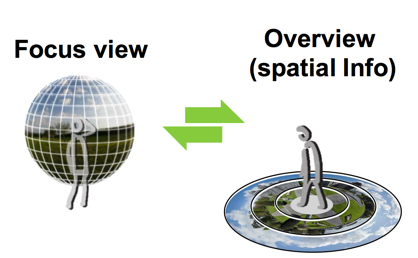
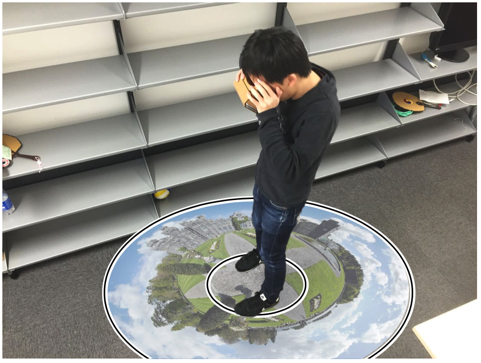
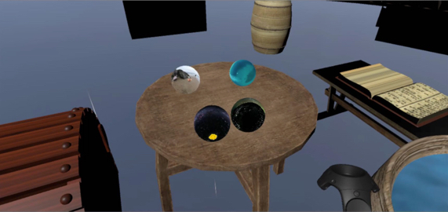

### OSC(Open Sound Control)
#### Arduino integration

#### vibration actuator
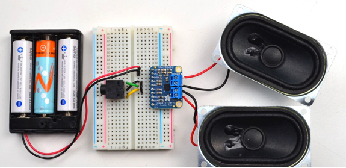

### Leap Motion
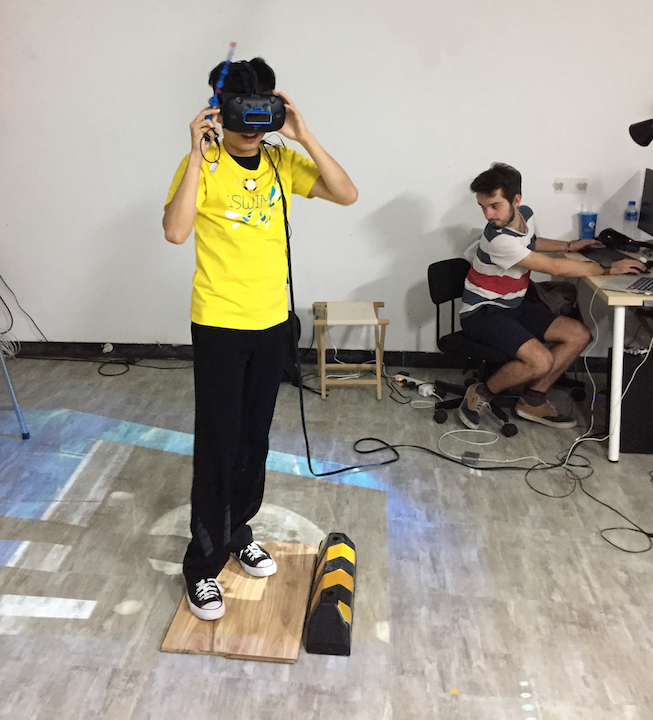
#### Integrated into VR

### Floor Projection
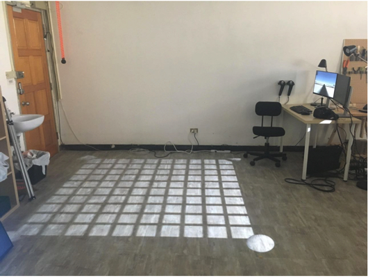

#### Calibration
This transformation is called an extrinsic matrix(外部矩阵) of a camera. This operation is also called homographic transformation(单应变换).
[点我参考](http://ksimek.github.io/2012/08/13/introduction/)
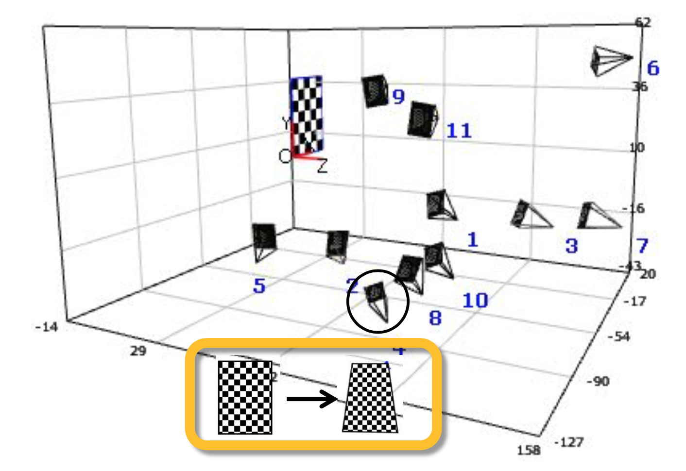
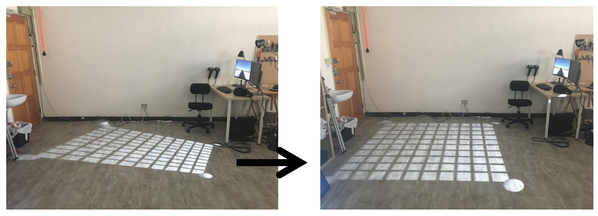

# Our Project - One Piece in Collaborative VR

### Flow chart
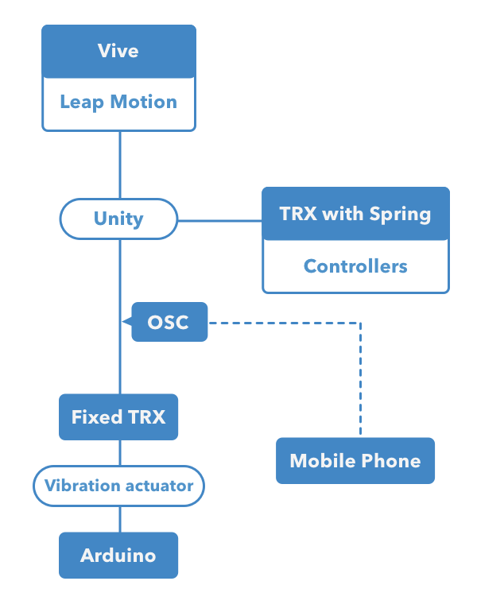

### Lo-Fi
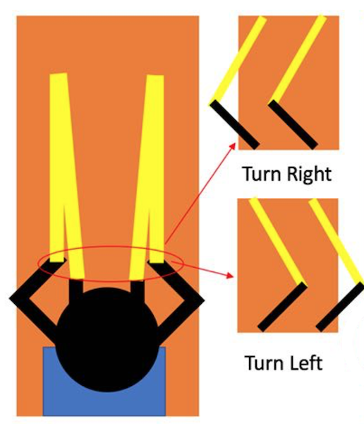

### TRX Room Setting & Hi-Fi
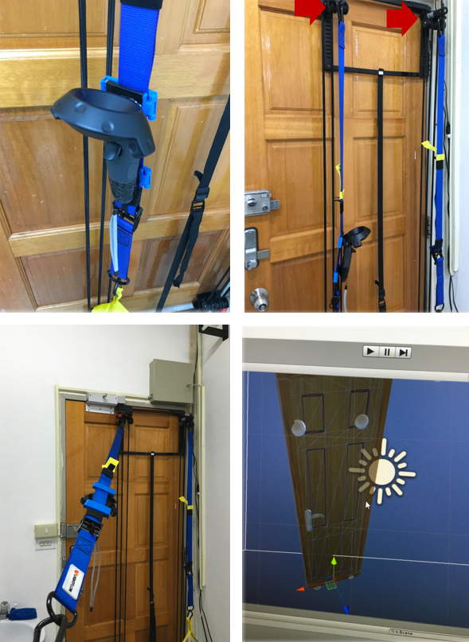
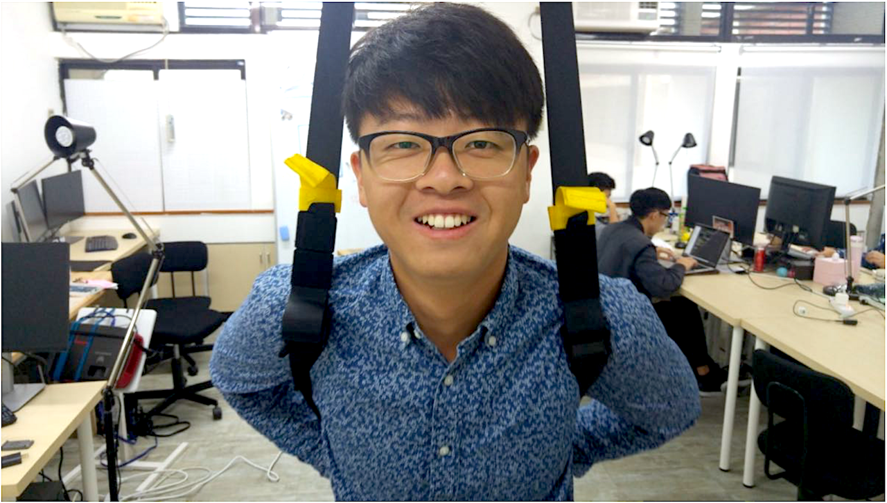

### Final Demo
Finally, we invited our classmates to try our creation which bring a brand new experience.
<video width="658" height="380" src="IDVR.mp4" controls="controls"></video>

### Team members
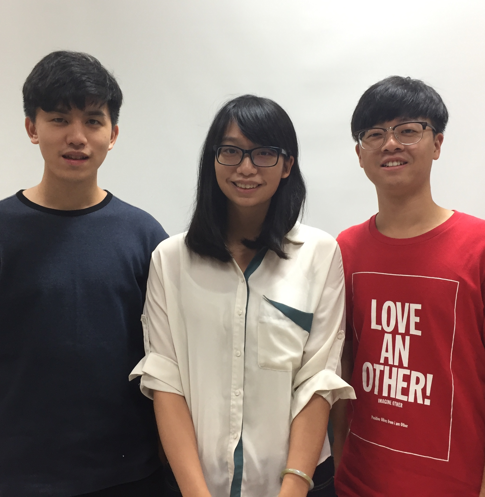
